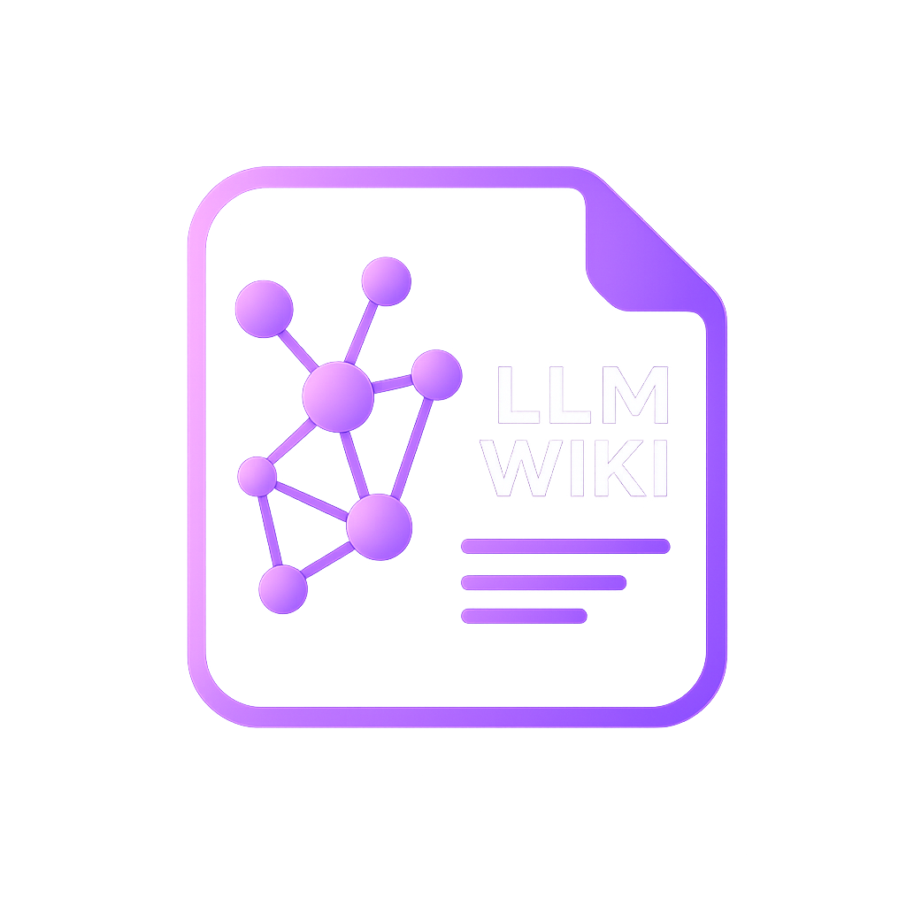

# WikiMind

<p align="center">
  
</p>

<p align="center">
  <strong>A Self-Maintaining Knowledge Agent with Autonomous Claim Decay & Multi-Voter Judge Ensembles</strong><br>
  WikiMind compiles documents into a structured, interlinked wiki — then continuously audits its own knowledge, re-verifies stale claims, and resolves contradictions through background LLM judge panels.
</p>

<p align="center">
  <a href="#about">About</a> •
  <a href="#core-philosophy-decay-first-knowledge">Core Philosophy</a> •
  <a href="#what-wikimind-adds-beyond-llm_wiki">What WikiMind Adds</a> •
  <a href="#feature-deep-dive">Feature Deep Dive</a> •
  <a href="#the-decay-formula">Decay Formula</a> •
  <a href="#tech-stack">Tech Stack</a> •
  <a href="#getting-started">Getting Started</a> •
  <a href="#project-structure">Project Structure</a> •
  <a href="#api--mcp-server">API & MCP</a> •
  <a href="#agent-skills">Agent Skills</a> •
  <a href="#credits">Credits</a>
</p>

---

## About

**WikiMind** is a cross-platform desktop application that transforms raw documents — PDFs, Word files, web pages, YouTube videos, GitHub repositories — into an active, self-correcting knowledge base. Built with **Tauri v2** (Rust backend) and **React 19** (TypeScript frontend), it runs entirely on your local machine.

Unlike traditional RAG pipelines that re-derive answers from scratch on every query, WikiMind **compiles knowledge once** into a persistent, Obsidian-compatible wiki, then deploys autonomous background agents to keep that knowledge fresh. Every factual claim carries a **confidence score** that decays over time. When claims go stale, WikiMind automatically re-researches them, detects contradictions, and runs multi-model judge panels to resolve disputes — all without human intervention unless escalation is needed.

### This Is Not a Clone

WikiMind is built upon and inspired by the excellent [nashsu/llm_wiki](https://github.com/nashsu/llm_wiki) — a full-featured desktop knowledge base application originally created by [nash_su](https://x.com/nash_su), implementing [Andrej Karpathy's LLM Wiki pattern](https://gist.github.com/karpathy/442a6bf555914893e9891c11519de94f). We inherit the core concepts: the three-layer vault architecture (raw sources → wiki → schema), the two-step chain-of-thought ingest pipeline, the knowledge graph with 4-signal relevance model, the Rust backend agent runtime, and the cross-platform Tauri packaging.

**However, WikiMind goes substantially beyond the original.** We introduce an entirely new layer of autonomous knowledge maintenance:

| Capability | llm_wiki (Original) | WikiMind (This Project) |
|---|---|---|
| Knowledge compilation | ✅ Two-step ingest | ✅ Two-step ingest + **post-ingest claim extraction** |
| Knowledge freshness | ❌ Static once written | ✅ **Confidence decay formula** with 4-parameter tuning |
| Contradiction handling | ❌ Manual review only | ✅ **3-model judge ensemble** with weighted majority voting |
| Background maintenance | ❌ None | ✅ **Cron-driven scheduler** (decay scan, re-verify, reconcile, health report) |
| Source ingestion | PDF, DOCX, web clips | PDF, DOCX, web clips + **YouTube transcripts** + **GitHub repos** |
| Page types | Concepts, entities, sources | Concepts, entities, sources + **claims/** + **contradictions/** |
| Edit history | ❌ None | ✅ **Git-style unified diffs** stored per page rewrite |
| Evaluation harness | ❌ None | ✅ **Single-judge vs. ensemble FPR comparison** |
| Maintenance dashboard | ❌ None | ✅ **Health overview, decay curves, job history, contradiction panel, activity timeline** |
| MCP tools | 9 tools | 9 original + **10 new WikiMind-specific tools** |

---

## Core Philosophy: Decay-First Knowledge

> *"Knowledge must be managed as a living, decaying asset that undergoes continuous, autonomous self-auditing."*

Most knowledge bases fail because they are treated as static archives. Information is dumped, and then it is forgotten. In reality, knowledge is dynamic, context-dependent, and subject to entropy. **It decays.**

### The Three Pillars

#### 1. Entropy Is the Default
Every fact has a half-life. A statement about software versions, APIs, team structures, or system architecture is true today but is highly likely to be outdated next year. Rather than treating all written text as permanently correct, WikiMind assigns a **confidence score** to every claim, which decays over time. The rate of decay is governed by the volatility of its domain — software frameworks decay faster than mathematical proofs.

#### 2. Autonomous, Continuous Self-Auditing
Static knowledge bases require manual gardening, which humans inevitably neglect. WikiMind delegates this work to an autonomous maintenance loop. Scheduled background workers constantly scan the vault:
- **Decay Scan (Nightly):** Automatically lowers confidence scores according to the decay formula
- **Re-Verification (Twice Weekly):** When a claim's confidence falls below the stale threshold, background LLM judges seek new source materials to re-verify it
- **Contradiction Resolution (Weekly):** If conflicting claims are introduced, a multi-voter judge ensemble analyzes the evidence, resolves the dispute, and updates the wiki accordingly
- **Health Report (Monthly):** Aggregate vault statistics on freshness distribution, job history, and system health

#### 3. Review Over Erasure
Autonomous agents must not silently delete human-curated wiki pages. When auditing reveals high decay or contradictions, WikiMind creates actionable **Review Items** for the user. The system serves as a co-pilot that highlights blind spots, suggesting merges, updates, or disputes for human-in-the-loop validation.

---

## What WikiMind Adds Beyond `llm_wiki`

### Phase 0: Repository Rebrand
- Renamed all references from `LLM Wiki` → `WikiMind` across Tauri config, Cargo.toml, package.json, MCP server, Chrome extension, i18n strings, and UI components
- Changed project directory convention from `.llm-wiki/` → `.wikimind/` with backward-compatible migration
- Replaced all MCP tool names from `llm_wiki_*` → `wikimind_*`

### Phase 1: Claim Infrastructure
- Created `wiki/claims/` as a first-class page type with rich YAML frontmatter (confidence, source_count, last_verified, freshness_state, domain_volatility, sources array, history array)
- Built the **decay engine** in Rust (`src-tauri/src/maintenance/decay.rs`) implementing the exponential decay formula with configurable parameters
- Built the **claim manager** (`claims.rs`) with CRUD operations, freshness filtering, and sorted listing
- Built the **contradiction manager** (`contradictions.rs`) with status transitions (open → under_review → resolved/escalated) and bidirectional claim linking
- Extended concept/entity page frontmatter with `claim_count`, `stale_claim_count`, `avg_confidence`, `last_audited`
- Created frontend claim list view and detail view components

### Phase 2: Claim Extraction Pipeline
- Added a **post-ingest claim extraction pass** — after wiki pages are created, an LLM pass extracts atomic verifiable claims and deduplicates them against existing claims via vector search
- Claims are automatically linked to parent concept/entity pages

### Phase 3: Maintenance Scheduler
- Built a **Tokio-based interval scheduler** that parses cron expressions from `.wikimind/maintenance/schedule.json`
- Implemented the **re-research pipeline**: detect stale claims → web search for new evidence → compare → update confidence or create contradiction
- Added **page rewrite with history tracking** — every automated page update generates a Git-style unified diff stored in `.wikimind/history/`
- Job logging to `.wikimind/maintenance/jobs.jsonl` with structured metrics

### Phase 4: Judge Ensemble
- Built the **multi-voter LLM judge ensemble** (`ensemble.rs`) — three independent LLMs from different model families evaluate each contradiction
- Weighted majority voting with configurable escalation threshold
- **Evaluation harness** (`eval.rs`) for comparing single-judge vs. ensemble false-positive rates using labeled test cases
- API budget tracking with monthly caps

### Phase 5: Maintenance Dashboard
- Built 7 React dashboard panels: Health Overview (with donut chart), Decay Curves (Recharts line chart), Job History, Contradictions Panel, Activity Timeline, Ensemble Evaluation Display
- Added Maintenance sidebar tab with real-time data from Tauri commands

### Phase 6: Advanced Source Loaders & MCP Extension
- **YouTube Ingestion:** Shell out to `youtube-transcript-api`, parse JSON transcript, feed to ingest pipeline
- **GitHub Ingestion:** Shallow clone, read README/docs/key source files, extract architectural concepts and claims
- Extended MCP server with 10 new tools: `wikimind_guide`, `wikimind_create`, `wikimind_edit`, `wikimind_append`, `wikimind_delete`, `wikimind_lint`, `wikimind_claims`, `wikimind_contradictions`, `wikimind_decay_status`, `wikimind_maintenance_log`

---

## Feature Deep Dive

### Two-Step Chain-of-Thought Ingest (Inherited)
```
Step 1 (Analysis): LLM reads source → structured analysis
  - Key entities, concepts, arguments
  - Connections to existing wiki content
  - Contradictions & tensions with existing knowledge

Step 2 (Generation): LLM takes analysis → generates wiki files
  - Source summary with frontmatter
  - Entity/concept pages with cross-references
  - Updated index.md, log.md, overview.md
  - Review items for human judgment

Step 3 (NEW - Claim Extraction): Extract atomic claims
  - Deduplicate against existing claims via vector search
  - Create claims/*.md with initial confidence
  - Link to parent concepts/entities
```

### Knowledge Graph with 4-Signal Relevance Model (Inherited)
| Signal | Weight | Description |
|--------|--------|-------------|
| Direct link | ×3.0 | Pages linked via `[[wikilinks]]` |
| Source overlap | ×4.0 | Pages sharing the same raw source |
| Adamic-Adar | ×1.5 | Pages sharing common neighbors |
| Type affinity | ×1.0 | Bonus for same page type |

Visualized with **sigma.js + graphology + ForceAtlas2**, including Louvain community detection, cohesion scoring, and interactive graph insights (surprising connections, knowledge gaps, bridge nodes).

### Rust Backend Chat Agent with Skills (Inherited + Extended)
The agent runtime supports tool-using chat with wiki search, source search, graph search, web search, workspace file tools, and shell commands. WikiMind extends it with:
- `claims.list` / `claims.create` / `contradictions.list` / `decay.status` tools
- **Skill management**: scan and enable local `SKILL.md` folders, select skills per conversation with `/skill`
- **Generated workspace outputs**: files produced by Agent tools are shown as previews

### Multi-Format Document Support (Inherited)
| Format | Method |
|--------|--------|
| PDF | Built-in pdfium (Rust) + optional MinerU cloud parsing |
| DOCX | docx-rs — headings, bold/italic, lists, tables |
| PPTX | ZIP + XML — slide-by-slide extraction |
| XLSX/XLS/ODS | calamine — proper cell types, multi-sheet |
| Images | Native preview (png, jpg, gif, webp, svg) |
| Video/Audio | Built-in player |
| Web clips | Readability.js + Turndown.js → clean Markdown |
| **YouTube** | **NEW** — youtube-transcript-api → structured Markdown |
| **GitHub** | **NEW** — shallow clone → README/docs extraction |

### Chrome Web Clipper (Inherited)
Manifest V3 extension with Mozilla Readability.js, Turndown.js, project picker, and auto-ingest via local HTTP API.

---

## The Decay Formula

### Definition

```
C(t) = C_base × exp(-λ_eff × Δt)

λ_eff = λ₀ × V × (1 / (1 + α × S)) × (1 + β × K)
```

| Parameter | Default | Meaning |
|---|---|---|
| `λ₀` | 0.01 | Base decay constant. Half-life ≈ 69 days with no modifiers |
| `V` | `{low: 0.5, medium: 1.0, high: 2.0}` | Domain volatility multiplier |
| `α` | 0.3 | Source-damping factor. More sources → slower decay |
| `S` | `source_count` | Number of independent corroborating sources |
| `β` | 0.5 | Contradiction-acceleration factor |
| `K` | `contradiction_count` | Number of unresolved contradictions |

### Freshness Thresholds

| State | Condition | UI Color |
|---|---|---|
| `fresh` | `C(t) ≥ 0.7 × C_base` | 🟢 Green |
| `aging` | `0.4 × C_base ≤ C(t) < 0.7 × C_base` | 🟡 Yellow |
| `stale` | `0.2 × C_base ≤ C(t) < 0.4 × C_base` | 🟠 Orange |
| `decayed` | `C(t) < 0.2 × C_base` | 🔴 Red |

---

## Tech Stack

| Layer | Technology |
|---|---|
| Desktop | Tauri v2 (Rust backend) |
| Frontend | React 19 + TypeScript + Vite |
| UI | shadcn/ui + Tailwind CSS v4 |
| Editor | Milkdown (ProseMirror-based WYSIWYG) |
| Graph | sigma.js + graphology + ForceAtlas2 |
| Search | Tokenized search + graph relevance + optional vector (LanceDB) |
| Vector DB | LanceDB (Rust, embedded) |
| PDF | pdfium + optional MinerU cloud parser |
| Office | docx-rs + calamine |
| Charts | Recharts (maintenance dashboard) |
| Scheduler | Tokio intervals + cron expression parsing |
| i18n | react-i18next (English + Chinese) |
| State | Zustand |
| LLM | Streaming fetch (OpenAI, Anthropic, Google, Ollama, Custom) |
| Web Search | Tavily, SerpApi, SearXNG JSON API |
| MCP | Node.js MCP server (19 tools) |

---

## Getting Started

### Prerequisites
- **Node.js** v20+
- **Rust** v1.75+ (with `cargo`)
- **Protobuf Compiler** (`protoc`) — required by LanceDB's `lance-encoding` crate
  - **Windows:** `winget install Google.Protobuf` (then set `$env:PROTOC` to the binary path)
  - **macOS:** `brew install protobuf`
  - **Linux:** `apt install protobuf-compiler` or equivalent

### Build from Source

```bash
git clone https://github.com/rupanshsoni/Wiki-Mind-llm.git
cd Wiki-Mind-llm
npm install
```

#### Development (hot-reload)

**Windows (PowerShell):**
```powershell
$env:PROTOC = "path\to\protoc.exe"
npm run tauri dev
```

**macOS / Linux:**
```bash
export PROTOC=$(which protoc)
npm run tauri dev
```

#### Production Build
```bash
npm run tauri build
```

### Chrome Extension
1. Open `chrome://extensions`
2. Enable "Developer mode"
3. Click "Load unpacked"
4. Select the `extension/` directory

### Quick Start
1. Launch the app → Create a new project (choose a template)
2. Go to **Settings** → Configure your LLM provider (API key + model)
3. Optional: configure **Web Search** providers for Deep Research and re-verification
4. Go to **Sources** → Import documents (PDF, DOCX, MD, YouTube URL, GitHub URL)
5. Watch the **Activity Panel** — LLM automatically builds wiki pages and extracts claims
6. Use **Chat** to query your knowledge base with source citations
7. Browse the **Knowledge Graph** to see connections and communities
8. Check the **Maintenance Dashboard** for claim freshness, decay curves, and job history
9. Check **Review** for items needing your attention
10. The scheduler runs automatically — claims decay, get re-verified, and contradictions get resolved in the background

---

## Project Structure

### Application Code
```
WikiMind/
├── src-tauri/                        # Rust backend (Tauri v2)
│   ├── src/
│   │   ├── lib.rs                    # App lifecycle, plugin registration, managed state
│   │   ├── main.rs                   # Entry point
│   │   ├── api_server.rs             # HTTP API on :19828
│   │   ├── clip_server.rs            # Chrome extension clip receiver
│   │   ├── tray.rs                   # System tray menu
│   │   ├── agent/
│   │   │   ├── runtime.rs            # LLM tool-use loop with streaming
│   │   │   ├── tools.rs              # Wiki/source/graph/web/claim tools
│   │   │   ├── provider.rs           # Multi-provider LLM client
│   │   │   ├── session.rs            # Conversation persistence
│   │   │   ├── skills.rs             # SKILL.md discovery and injection
│   │   │   └── context.rs            # Context assembly
│   │   ├── commands/
│   │   │   ├── fs.rs                 # File operations, PDF/DOCX/PPTX/XLSX extraction
│   │   │   ├── project.rs            # Project CRUD
│   │   │   ├── search.rs             # Keyword + vector hybrid search
│   │   │   ├── vectorstore.rs        # LanceDB embedding storage
│   │   │   ├── youtube.rs            # YouTube transcript ingestion
│   │   │   ├── github.rs             # GitHub repo ingestion
│   │   │   └── ...
│   │   └── maintenance/              # ★ NEW: WikiMind maintenance engine
│   │       ├── mod.rs                # Module aggregator
│   │       ├── decay.rs              # Confidence decay formula
│   │       ├── claims.rs             # Claim CRUD + freshness classification
│   │       ├── contradictions.rs     # Contradiction CRUD + status transitions
│   │       ├── scheduler.rs          # Tokio cron-based job scheduler
│   │       ├── pipeline.rs           # Re-research orchestration pipeline
│   │       ├── ensemble.rs           # Multi-voter LLM judge ensemble
│   │       ├── eval.rs               # Single-judge vs. ensemble evaluation
│   │       ├── extract.rs            # Post-ingest claim extraction
│   │       ├── history.rs            # Git-style unified diff tracking
│   │       └── jobs.rs               # Job log serialization
│   └── tauri.conf.json
├── src/                              # React 19 frontend
│   ├── App.tsx                       # Main app with routing
│   ├── components/
│   │   ├── editor/                   # Milkdown WYSIWYG editor
│   │   ├── graph/                    # sigma.js knowledge graph
│   │   ├── chat/                     # Multi-conversation chat
│   │   ├── review/                   # Async review queue
│   │   ├── project/                  # Project creation/open dialogs
│   │   ├── settings/                 # Settings panels
│   │   ├── layout/                   # App layout, sidebar, file tree
│   │   └── maintenance/              # ★ NEW: Dashboard panels
│   │       ├── maintenance-dashboard.tsx
│   │       ├── health-overview.tsx    # Donut chart, stats
│   │       ├── decay-chart.tsx       # Recharts confidence curves
│   │       ├── claims-list.tsx       # Filterable claim table
│   │       ├── claim-detail.tsx      # Claim detail view
│   │       ├── contradictions-panel.tsx
│   │       ├── job-history.tsx       # Job log viewer
│   │       └── activity-timeline.tsx # Unified event timeline
│   ├── stores/                       # Zustand state management
│   └── lib/                          # Utilities, ingest pipeline, search
├── mcp-server/                       # Node.js MCP server (19 tools)
├── extension/                        # Chrome web clipper
├── frontend_skills/                  # UI/UX design skills
└── docs/                             # Architecture, philosophy, data models
```

### Wiki Vault Structure (per project)
```
my-wiki/
├── purpose.md                        # Goals, key questions, research scope
├── schema.md                         # Wiki structure rules, page types
├── raw/
│   ├── sources/                      # Uploaded documents (immutable)
│   └── assets/                       # Local images
├── wiki/
│   ├── index.md                      # Content catalog
│   ├── log.md                        # Chronological operation record
│   ├── overview.md                   # Global summary (auto-updated)
│   ├── entities/                     # People, organizations, products
│   ├── concepts/                     # Theories, methods, techniques
│   ├── sources/                      # Source summaries
│   ├── claims/                       # ★ Atomic verifiable assertions (with decay)
│   ├── contradictions/               # ★ Documented disagreements between claims
│   ├── queries/                      # Saved chat answers + research
│   └── comparisons/                  # Side-by-side analysis
├── .obsidian/                        # Obsidian vault config (auto-generated)
└── .wikimind/                        # App config
    ├── project.json                  # Project UUID and metadata
    ├── chats/                        # Chat conversation history
    ├── maintenance/
    │   ├── schedule.json             # ★ Scheduler cron configuration
    │   ├── jobs.jsonl                # ★ Maintenance job log
    │   └── eval/                     # ★ Judge evaluation data
    │       ├── cases.jsonl
    │       └── results.jsonl
    └── history/
        └── *.diff                    # ★ Page rewrite diffs
```

---

## API & MCP Server

### Local HTTP API
WikiMind ships a built-in HTTP API at `http://127.0.0.1:19828` (token-protected, localhost-only):

| Endpoint | Method | Description |
|---|---|---|
| `/api/v1/health` | GET | Server status |
| `/api/v1/projects` | GET | List projects |
| `/api/v1/projects/:id/files` | GET | List project files |
| `/api/v1/projects/:id/search` | POST | Hybrid search (keyword + vector) |
| `/api/v1/projects/:id/chat` | POST | Backend agent chat |
| `/api/v1/projects/:id/graph` | GET | Knowledge graph data |
| `/api/v1/projects/:id/claims` | GET | List claims with freshness filter |
| `/api/v1/projects/:id/contradictions` | GET | List contradictions |
| `/api/v1/projects/:id/maintenance/status` | GET | Scheduler and decay overview |
| `/api/v1/projects/:id/maintenance/jobs` | GET | Job history |
| `/api/v1/projects/:id/maintenance/run` | POST | Trigger a maintenance job |
| `/api/v1/projects/:id/ingest/youtube` | POST | Ingest YouTube transcript |
| `/api/v1/projects/:id/ingest/github` | POST | Ingest GitHub repository |

### MCP Server
The bundled MCP server in `mcp-server/` exposes 19 tools for downstream AI agents:

**Original (from llm_wiki):** `wikimind_search`, `wikimind_read`, `wikimind_list`, `wikimind_graph`, `wikimind_reviews`, `wikimind_resolve_review`, `wikimind_bulk_resolve`, `wikimind_rescan`, `wikimind_chat`

**New (WikiMind additions):** `wikimind_guide`, `wikimind_create`, `wikimind_edit`, `wikimind_append`, `wikimind_delete`, `wikimind_lint`, `wikimind_claims`, `wikimind_contradictions`, `wikimind_decay_status`, `wikimind_maintenance_log`

---

## Agent Skills

WikiMind supports **agent skills** — structured instruction files (`SKILL.md`) that extend the chat agent's capabilities:
- Scan project and user skill folders automatically
- Enable/disable skills in Settings
- Select a skill per conversation with `/skill` completion
- Skills can request structured user input (single choice, multiple choice, free text)

The project includes frontend design skills in `frontend_skills/` for premium UI/UX guidance.

---

## Credits

- **Base Application:** [nashsu/llm_wiki](https://github.com/nashsu/llm_wiki) by [nash_su](https://x.com/nash_su) — the production desktop application with knowledge graph, vector search, agent runtime, review system, and cross-platform packaging
- **Original Pattern:** [Andrej Karpathy's LLM Wiki](https://gist.github.com/karpathy/442a6bf555914893e9891c11519de94f) — the methodology for building personal knowledge bases using LLMs
- **Feature Donors:** Patterns from [obsidian-second-brain](https://github.com/) (bi-temporal facts, reconciliation logic, scheduled agents) and [llmwiki](https://github.com/) (MCP tool surface, VaultFS abstraction) were adapted for WikiMind's architecture

---

## License

MIT License. Built upon open-source code from [llm_wiki](https://github.com/nashsu/llm_wiki).
